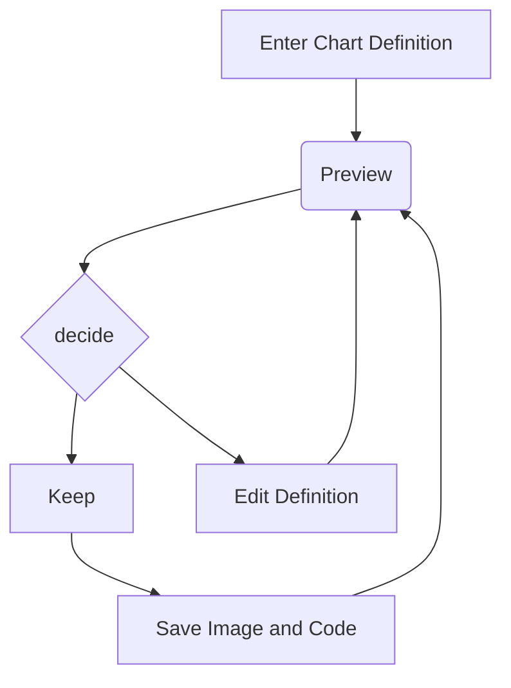

Exemplo de Código Java
```java
public double verSaldo(){
    return this.saldo;
}

```

Exemplo do diagrama do Mermaid


```mermaid
graph TD
    A[Enter Chart Definition] --> B(Preview)
    B --> C{decide}
    C --> D[Keep]
    C --> E[Edit Definition]
    E --> B
    D --> F[Save Image and Code]
    F --> B
```

