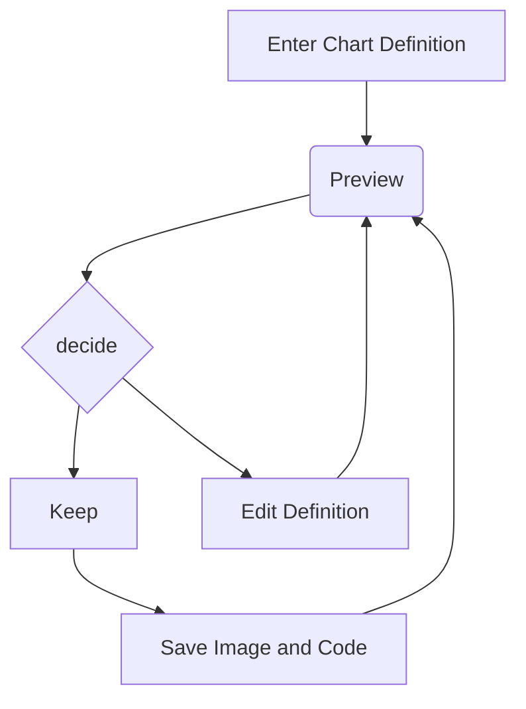

Quando quiserem autenticar contas, use:
```java
	public boolean autenticar (Conta conta) {
		boolean resp = false;
		
		// autenticação acontece aqui
		
		return resp;
	}
```

Exemplo do diagrama do Mermaid



