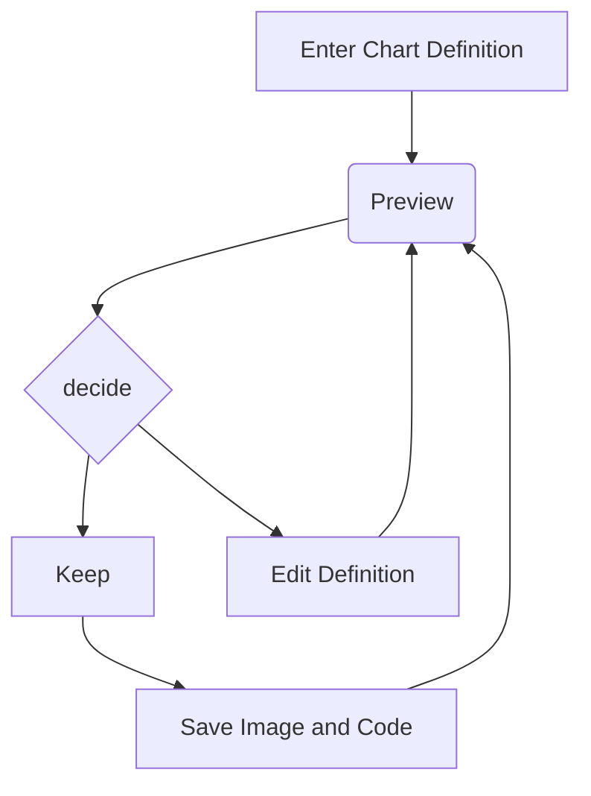

Exemplo de como consultar o saldo através da conta que está em cliente
```java
public class Principal {

	public static void main(String[] args) {
		Conta conta = new Conta();
		conta.setSaldo(2000);
		
		Cliente cli = new Cliente();
		cli.setNome("João");
		cli.setConta(conta);
		
		System.out.println(cli.getNome() + " tem "+
						   cli.getConta().verSaldo()+ " reais.");
	}
}
```

Exemplo do diagrama do Mermaid



